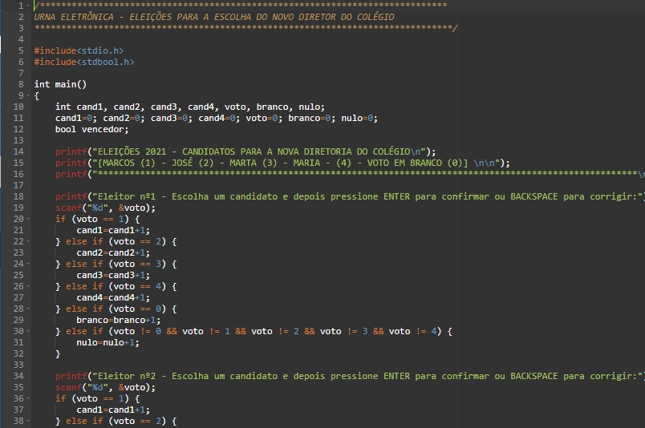

<h2>URNA ELETRÔNICA - ELEIÇÕES PARA A ESCOLHA DO NOVO DIRETOR DO COLÉGIO</h2>                            

<h3>Pratiques</h3>

Sisteminha criado, na linguagem C, para a avaliação final/ 1º Semestre - Na disciplina de Programação Estruturada - IFSULDEMINAS

<h3>Pratiques</h3>

<h4>Instruções:</h4>

Crie um programa na linguagem C que transforme o seu computador em uma urna eletrônica para uma eleição.

<h4>Regras:</h4>
<lu>
    <li>O objetivo da eleição deve ser definido pela equipe e deve ser apresentado no
        programa. Exemplo: “​Eleição do Coordenador do Curso​”.</li>
    <li>Essa eleição deve possuir no mínimo 4 candidatos.O nome dos candidatos devem  aparecer na tela do programa para o usuário poder escolher.</li>
    <li>Cada voto deve ser dado pelo número do candidato,permitindo-se ainda o voto em branco(0)e voto nulo(quando vota em um candidato que não existe).</li>
  <li>No final da eleição,o programa deve emitir um relatório contendo a votação de cada candidato, de votos em branco, de votos nulos e o candidato eleito(se houve empate, ele também deve ser divulgado).</li>
    <li>Deverá ser considerado que a cidade possui somente 5 eleitores</li>
</lu>

<h4>RESTRIÇÕES:
</h4>
<lu>
<li>Pode ser utilizado somente o comando IF-ELSE (somente o IF também é permitido).</li>
<li>Se algum dos comandos abaixo for em utilizados, o pratiques vai ser desconsiderado: ○s witch-case; ○ for; ○ while; ○ do-while.</li>
<li>Não pode utilizar estruturas de armazenamento, como vetores, matrizes ou structs</li>
<li>Não é permitido a utilização de outras funções além do main().</li>
    </lu>

    
Contatos
André Alves: andrealves-tec@hotmail.com

Linkedin: https://www.linkedin.com/in/andrealves8/

Github: https://github.com/andrealves8

